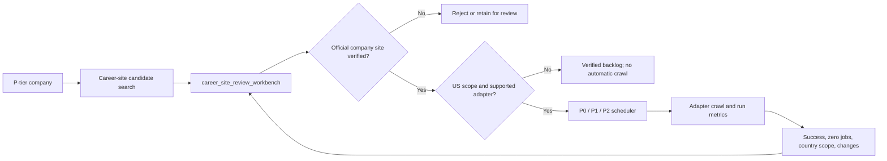

# Career-site discovery pilot

## Cohort and cost

The first pilot covers every consolidated company with `priority_score >= 4.5`:

- Companies: 103
- Successful searches: 103
- Effective pilot search credits: 103
- Additional cancelled dry-run searches: 26
- Total Tavily basic-search credits consumed: approximately 129
- Tavily basic search cost: one credit per company

No LLM or browser rendering is used. Tavily returns candidates; it does not
verify or enable them.

## Pilot result

After automatic removal of known aggregators and external job boards:

- Companies with candidates awaiting review: 100
- Companies with no retained candidate: 3
- Review candidates: 245
- Verified sites: 0 until human review
- Crawl-enabled sites: 0 until human review

Candidate source distribution:

| Source | Candidates |
|---|---:|
| Generic official-looking HTML | 210 |
| Workday | 21 |
| Greenhouse | 7 |
| iCIMS | 3 |
| Lever | 3 |
| SmartRecruiters | 1 |

## TablePlus review workflow

Open schema `jobpush`, then use **`career_site_review_workbench`** for the
full company/site audit surface. It is the canonical one-company-per-row view
and contains the verified URL plus up to three review candidates for every
discovery source, including direct ATS URL guessing
(`discovery_source='ats_url_guess'`). Site review is an override surface, so
verified/auto-trusted rows may still be shown when Nicole wants to audit or
override them. The full workbench sorts:

1. manual P0 needing review;
2. verified manual P0 in the audit surface only, including Google;
3. Chicago + LinkedIn, Chicago, LinkedIn, large sponsors;
4. remaining score/diverse samples.

Review candidate 1 first. If it is wrong, inspect candidate 2 and candidate 3
when they are present.
Migration 057 removed those redundant human-facing views. Candidate URLs are
already exposed as columns in `career_site_review_workbench`; use
`career_sites` only when a detailed one-row-per-URL audit is needed.

Confirm a site:

```sql
SELECT jobpush.review_career_site(
    12345, 'verified', 'nicole', 'Official company career or ATS site'
);
```

Reject a site:

```sql
SELECT jobpush.review_career_site(
    12345, 'rejected', 'nicole', 'Aggregator, wrong entity, or unrelated brand'
);
```

Replace `12345` with the candidate site ID shown in the review view. Confirming
a site enables it for future crawling and marks the company `found`. Rejecting
one candidate keeps the company in review while other candidates remain.

## Generalization loop

1. Human-review the 100 pilot companies.
2. Measure rank-1 precision and source-specific precision.
3. Add recurring false domains to
   `career_site_discovery_domain_excludes` and the Python deny list.
4. Add adapters for confirmed ATS sources.
5. Run a stratified 4.0/3.0/2.5 sample; only low-confidence candidates require
   human review.

Human review is a calibration sample, not a requirement for every company.
`career_site_review_precision` measures verified/rejected precision by source
type and candidate rank. Auto-verification may be enabled later only for a
narrow structured-ATS segment after it has enough reviewed examples and at
least 98% observed precision. Generic HTML and conflicting candidates remain
manual.

## Expansion order and cost

Use the cheapest reliable path first. Tavily is not the default expansion path.

| Step | Cost | Best for | Current read |
|---|---:|---|---|
| Existing verified / retained structured candidates | none | Companies already discovered by prior runs or Nicole | Highest yield; crawl immediately if adapter-supported |
| Direct ATS guessing | none | Greenhouse, Lever, Ashby, SmartRecruiters slugs | Fast and cheap, but poor for companies whose real site is Workday/Oracle/iCIMS/custom |
| Hidden ATS resolver from generic pages | none | Generic career pages that link to real ATS in HTML/JS | Better than blind guessing for stubborn generic blockers |
| Generic JSON-LD parser | none | Corporate pages exposing `schema.org/JobPosting` | Conservative; useful but low coverage |
| DuckDuckGo HTML search | free but noisy | Later P2/P3 discovery when no candidate exists | Use small batches; parse links through normal URL classifier |
| Bing Search API | quota-based | High-score companies with no candidate | Use only after checking current free quota |
| Tavily | paid credits | Last-resort search | Pause while P1/P2/P3 have cheaper paths |

The practical rule is "get a usable official site first, then improve it." Human
site review is the gold standard, but it is an override/calibration mechanism,
not a prerequisite for every company.

2026-06-29 P2/P3 expansion note: after redefining P3 as `priority_score > 1`,
direct ATS guessing found 15 candidates from 160 remaining P2/P3 generic
candidates. Rank-1 supported structured ATS auto-trust was widened to P2/P3;
the first due crawl succeeded for 47 P2 sites. P3 had no enabled structured
sites in that batch.

## Effective-tier expansion (2026-06-23)

The first expansion searched 150 never-searched P-tier companies, with manual
P0 first and high-score P1/P2 after it. It used 150 Tavily basic credits,
completed with zero search errors, and retained 381 candidates. The ranked
company review queue then contained 2 P0 and 221 P1 companies.

A second 50-company potential-P0 sample deliberately avoided alphabetical
selection. It stratified Chicago, LinkedIn Top Employer, large LCA sponsor, and
cross-score random groups. It retained 123 candidates with zero search errors;
examples include Ford, General Motors, Nike, Siemens, Bloomberg, Morningstar,
Medtronic, Deere, Motorola, Dropbox, and Chicago employers.

Known external aggregators such as TechFetch belong in both the database domain
exclude table and `scripts/discover_career_sites.py`; they must never be
verified as a company-owned career site.

`career_site_discovery_runs` records company counts, candidates, errors, and
estimated credits for every completed batch.

## P0/P1 monthly expansion policy (2026-06-24)

Historical note: this section records the earlier P0/P1-first rollout. The
current dashboard/reporting default is P0/P1/P2/P3 combined, with each tier
available separately. P1 remains the highest-value expansion focus, but P2/P3
are now included in coverage statistics and site review surfaces.

The operating goal is to make P0/P1 usable before spending time or credits on
P2. Use `db/run_discover_career_sites_p0_p1.sh` for the normal expansion path:

```bash
bash db/deploy_via_ssm.sh db/run_discover_career_sites_p0_p1.sh
```

That runner searches only enabled P0/P1 companies that have never had a
retained verified/unverified career-site candidate. It orders by effective tier
and then `priority_score DESC`, so the highest-scored P1 companies consume
credits first. The default batch cap is 600 companies / roughly 600 Tavily basic
search credits. Override with `DISCOVERY_LIMIT` only when running directly on
the EC2 host or after extending the deployment wrapper to pass environment
variables.

Do not run all P-tier companies automatically. Current constraints are:

- Tavily free Researcher plan is 1,000 credits/month.
- One basic search is approximately one credit per company.
- P1 alone is several thousand companies, so full P1 requires paid credits or
  multiple monthly resets.
- P2 remains paused until P0/P1 discovery, verification, adapter coverage, and
  dashboard monitoring are stable.

Human review is used to calibrate precision and mark high-value sites; it is
not expected to cover all P1 companies manually. Only promote narrow structured
ATS patterns to auto-verification after the precision gates in
`LEARNING_OPERATIONS.md` are satisfied.

If Tavily returns quota/authentication failures such as HTTP 432, stop the
batch immediately. `scripts/discover_career_sites.py` now aborts after three
consecutive fatal HTTP errors (401/402/403/429/432) instead of marking hundreds
of companies as failed. If an exhausted key accidentally marks companies
`retry`, run:

```bash
bash db/deploy_via_ssm.sh db/run_reset_tavily_quota_failures.sh
```

Check the active AWS-stored key without printing it:

```bash
bash db/deploy_via_ssm.sh db/run_tavily_usage_status.sh
```

### 2026-06-24 expansion runs

Two score-ordered expansion runs completed against P0/P1 demand before P2:

| Companies searched | Candidates retained | Search errors |
|---:|---:|---:|
| 640 | 1,629 | 0 |
| 980 | 2,475 | 0 |
| 980 | 2,357 | 0 |
| **2,600** | **6,461** | **0** |

After these runs, the P1 discovery state was 23 verified, 2,808 awaiting
candidate review, 55 not found, and 1,759 not yet searched. Each 980-company
run used a newly rotated independent Tavily account and reserved approximately
20 of its 1,000 free-plan credits based on request count.

Operational caveat: Tavily's `/usage` response still reported zero immediately
after the 980 successful searches. Treat request count as the conservative
credit ledger until the provider usage endpoint catches up; do not launch
another large batch merely because that endpoint temporarily shows unused
credits.

### 2026-06-24 / 2026-06-25 actual ledger

As of the latest audit:

| Metric | Count |
|---|---:|
| Discovery runs | 10 |
| Companies searched / estimated basic-search credits | 4,453 |
| Retained career-site candidates | 9,488 |
| Search errors from one exhausted/bad-key batch | 600 |
| Companies with retained candidates | 3,770 |
| Companies with structured ATS candidates | 978 |
| Companies with verified / crawl-enabled site | 933 |

The important distinction: a Tavily discovery search produces *candidate URLs*.
It does not automatically mean the company has a safe, adapter-supported,
US-scoped career site. Most retained candidates are `generic_html`; those are
kept for review or later generic parsing but are not automatically enabled for
daily crawl. Best supported structured ATS candidates are auto-trusted only for
supported adapters:

```bash
bash db/deploy_via_ssm.sh db/run_apply_career_site_auto_trust.sh
```

Tavily cost model: JobPush sends one basic Tavily search per company. That one
search can return multiple results; JobPush keeps up to three candidates after
dedupe and scoring. Therefore three candidates do **not** mean three Tavily
credits. The waste mode is not candidate count; it is spending one company
search and receiving only generic pages, external job boards, wrong-company
pages, or unsupported ATS pages.

Normal expansion policy, updated 2026-06-28:

- Search only companies that are `discovery_status='pending'` and
  `last_discovery_at IS NULL`.
- Exclude companies that already have verified or unverified retained
  candidates in `career_sites`.
- Do not include historical `retry` or `not_found` rows in normal expansion.
  Those rows have already spent at least one company-level search credit.
- Retry historical failures only through an explicit recovery/reset step after
  checking whether the failure was provider/key/network-wide. A single-company
  failure is expected to fail again and should not consume fresh credits during
  expansion.
- `searched_no_candidate` means Tavily ran successfully but returned no retained
  usable career candidate. It is not the same as a network failure; do not reset
  it casually.

From migration 091 onward, every finalized Tavily search is also written to
`career_site_discovery_attempts`, so credit usage can be audited by company,
run, tier, success/failure, and candidate count. Use:

```bash
bash db/deploy_via_ssm.sh db/run_tavily_discovery_credit_policy_audit.sh
```

to see the current never-searched eligible pool, excluded historical rows, and
recent run quality.

Historical runs before migration 091 have only run-level totals in
`career_site_discovery_runs`; their exact per-company attempt lists were not
archived.

To use residual credits from multiple Tavily keys safely, run:

```bash
bash db/deplete_tavily_keys.sh
```

Paste one key per line, then press Ctrl-D. The script checks each key's usage,
keeps a small reserve by default, rotates only the active AWS secret, and runs
never-searched P-tier discovery in 150/30/10-company chunks. It does not print
or commit keys.

Candidate ranking rule: `scripts/discover_career_sites.py` queries
`"<company>" official careers jobs`, scores each returned URL with
`candidate_score`, removes duplicate URLs, then stores the top candidates by
score. The score favors employer-owned career/careers/jobs pages and known ATS
platforms; it penalizes external aggregators and weak company-name matches.
The operational review surface is `jobpush.career_site_review_workbench`, and
the dashboard can export a site-review batch with candidate 1/2/3 for sampling.
Already verified/auto-trusted rows remain available for manual override.

2026-06-25 update after key rotation: an additional 950 P0/P1 companies were
searched, retaining 2,237 candidates with zero provider errors. Auto-trust
promoted 209 best supported structured ATS sites. P1 coverage reached 933 enabled
sites, with 347 successfully crawled so far.

2026-06-25 later audit: P1 successful crawl coverage reached 913 companies.
The reason this is far below the 4,453 searched-company ledger is that many
Tavily results were external job boards or ordinary generic career pages. The
pipeline now distinguishes these outcomes:

1. **Structured ATS**: Workday, Greenhouse, Lever, Ashby, SmartRecruiters,
   iCIMS, and other detectable ATS platforms. These can become crawlable after
   adapter support and trust rules.
2. **Generic official-looking HTML**: company career pages that may still hide
   a real ATS link. These go through the zero-credit generic HTML resolver.
3. **External job boards / aggregators**: Wellfound, Zippia, Built In, Lensa,
   MyVisaJobs, VC portfolio job boards, and similar domains. These are rejected
   because they are not employer-owned career sites.

Migration 074 added the first broad cleanup for category 3 and reclassified
historical candidates on Jobvite, Workable, Paylocity, Rippling, UltiPro, and
TriNet Hire out of `generic_html` into platform-specific `source_type` values.
Future Tavily searches also use the expanded deny list in
`scripts/discover_career_sites.py`, so the same class of bad candidates should
not keep consuming review time.

## Generic HTML resolution strategy

Generic HTML is handled in three layers, in this order:

1. **Reject known non-employer domains.** External job boards and VC portfolio
   boards are not official company career sites, even when they contain real
   jobs.
2. **Resolve hidden ATS links without Tavily.** Run:

   ```bash
   bash db/deploy_via_ssm.sh db/run_resolve_generic_html_ats_links.sh
   ```

   This fetches retained generic pages, scans outbound links, and writes any
   discovered ATS links back to `career_sites` with
   `discovery_source='generic_html_link_resolver'` and zero estimated credits.
   Larger zero-credit batches are available when the queue is clearly dominated
   by generic pages:

   ```bash
   bash db/deploy_via_ssm.sh db/run_resolve_generic_html_ats_links_500.sh
   bash db/deploy_via_ssm.sh db/run_resolve_generic_html_ats_links_1000.sh
   ```

   Every processed generic page is marked with
   `last_error='generic_ats_resolution_attempted...'` so later batches do not
   repeatedly request pages that already produced no structured ATS link.
   This marker is operational only; it does not reject the site or delete the
   candidate.
3. **Guess structured ATS boards without Tavily.** For companies that still
   have only retained generic career pages, run deterministic public ATS probes
   before writing custom generic parsers:

   ```bash
   bash db/deploy_via_ssm.sh db/run_guess_ats_sites.sh
   bash db/deploy_via_ssm.sh db/run_guess_ats_sites_500.sh
   ```

   `scripts/guess_ats_sites.py` builds conservative company/domain slug
   variants and probes public JSON APIs for Greenhouse, Lever, Ashby, and
   SmartRecruiters. It writes normal `career_sites` candidates with
   `discovery_source='ats_url_guess'` and `estimated_credits=0`. This is the
   safe version of the "try `{company}.greenhouse.io` /
   `jobs.lever.co/{company}`" idea: it validates through ATS APIs instead of
   trusting a plain HTTP 200 page.

   Quality gates:

   - Do not auto-enable zero-job guessed boards.
   - Do not use generic slugs such as `jobs`, `careers`, `global`, `services`,
     `healthcare`, `glassdoor`, or similar noisy aliases.
   - Run the cleanup/audit before trusting a new batch:

     ```bash
     bash db/deploy_via_ssm.sh db/run_remove_dangerous_ats_url_guess_slugs.sh
     bash db/deploy_via_ssm.sh db/run_ats_url_guess_audit.sh
     ```

   - Then apply structured ATS auto-trust and crawl:

     ```bash
     bash db/deploy_via_ssm.sh db/run_apply_career_site_auto_trust.sh
     bash db/deploy_via_ssm.sh db/run_due_crawl_batch_120.sh
     ```

   Workday and iCIMS are not included in deterministic guessing yet because
   their public URLs have more tenant/site-path variation and plain 200 checks
   have higher false-positive risk. Add them only after a stronger validator is
   available.

   Do not use Google search-result HTML scraping as a production dependency.
   It is fragile, captcha-prone, and harder to operate reliably. Use official
   search APIs only when credits/budget allow, or keep Google as a manual
   research aid outside the automated pipeline.
4. **Write parsers only for repeatable patterns.** Do not build one-off parsers
   for every company page. First group remaining generic pages by domain,
   template, or platform. Then add a parser only when the group is large enough
   or high-priority enough to justify the maintenance cost.
   Do not blindly expand `generic_html`: when the latest batch yield is low,
   switch back to hidden ATS detection and template clustering.

Use the audit runner to pick the next parser target:

```bash
bash db/deploy_via_ssm.sh db/run_generic_html_resolution_audit.sh
```

The preferred next parser targets are platform-like domains that recur across
companies, not arbitrary single-company custom pages. As of migration 074,
newly separated examples include Jobvite, Workable, Paylocity, Rippling,
UltiPro, TriNet Hire, and Comeet. Adapter work should start with the platform
that has the best combination of P1 count, URL consistency, and available
public API or predictable HTML.

2026-06-27 P1 top-1000 blocker audit:

| State | Companies | Share |
|---|---:|---:|
| Successfully crawled | 332 | 33.20% |
| Generic HTML needs resolution | 607 | 60.70% |
| Searched, no usable candidate | 26 | 2.60% |
| Adapter or site failed | 19 | 1.90% |
| Enabled but not due yet | 13 | 1.30% |
| Structured candidate not enabled | 3 | 0.30% |

This means high-score P1 expansion is primarily a generic-HTML resolution
problem, not a database-capacity problem. The next high-leverage work is to
turn generic official career pages into ATS links where possible, then build
repeatable generic parsers only for recurring templates.

2026-06-28 direct ATS guessing update:

- The first strict direct-guess rounds processed 1,500 generic P1 candidates
  with zero Tavily credits.
- The useful hit rate dropped as the easier structured ATS companies were
  exhausted: early batches produced dozens of candidates, while a later
  500-company batch produced 33 candidates and 24 newly enabled sites.
- P1 crawl coverage improved to 1,619 successfully crawled companies out of
  4,634 P1 companies; 1,648 now have an enabled site.
- The remaining P1 blocker is still mostly generic HTML: 2,700 companies
  require site resolution or a repeatable generic parser.

Interpretation: direct ATS guessing is worth continuing in controlled batches
because it is free and auditable, but it will not solve all generic HTML. The
next expansion path is to group the remaining generic pages by platform or page
template and implement parsers only for the largest repeatable groups.

2026-06-27 cleanup/update:

- A 50-company zero-credit generic resolver pilot found no new ATS links,
  confirming that blindly fetching generic pages is low yield without more
  cleanup and better page-pattern handling.
- Migration 086 rejected 219 obvious external / portfolio / aggregator generic
  candidates and reclassified 37 `jobs.jobvite.com` candidates from
  `generic_html` to `jobvite`.
- Auto-trust promoted 20 newly usable structured ATS candidates, primarily
  Jobvite.
- Two scheduled crawl batches then validated the path: Jobvite grew from 1 to
  9 successful sites and parsed 141 jobs, including 19 target jobs.

### Platform adapter progress

| Platform | Status | Notes |
|---|---|---|
| Workable `apply.workable.com` / `jobs.workable.com` | Added in migration 075; expanded in migration 079 | Uses Workable markdown feeds, including `jobs.workable.com/company/...` pages that link to `jobs.md?companyId=...`. |
| Jobvite `jobs.jobvite.com` | Added in migration 076 | Parses board HTML and per-job schema.org `JobPosting` JSON-LD. |
| Paylocity | Added in migration 077 | Parses `window.pageData.Jobs` on listing pages and schema.org `JobPosting` on detail pages. |
| Rippling `ats.rippling.com` | Added in migration 078 | Parses static Next.js pages: board links plus per-job `__NEXT_DATA__`. |
| Eightfold | Added for selected verified sites; expanded in migration 113; PCSX fallback added 2026-06-29 | Uses embedded `smartApplyData` when present, otherwise the PCSX search API. Auto-trust is conservative because some Eightfold-looking URLs are privacy/error/event pages rather than job boards. |
| Amazon Jobs / Cognizant Jobs | Expanded in migration 115 | Company-specific adapters with explicit US server filters. Migration 116 disables duplicate same-company/same-adapter sites after one canonical site succeeds. |
| SuccessFactors | Sample first | Do not build a broad adapter yet. First inspect 3–5 high-priority examples and confirm the company-specific API/HTML shape is stable; many retained candidates are generic root/login/CDN URLs. |
| UKG / UltiPro | Sample first | Do not build a broad adapter yet. First inspect 3–5 `recruiting.ultipro.com` examples and confirm URL token + HTML/API stability. |
| Phenom / TalentBrew / BrassRing | Identify only | Classify these out of `generic_html` for review/cluster visibility. Do not auto-enable until an adapter exists and a small sample proves stable. |
| TriNet Hire | Backlog | Reclassified out of `generic_html`; adapter not yet implemented. |
| Comeet | Backlog | Reclassified out of `generic_html`; adapter not yet implemented. |

The first Workable validation enabled three P1 `apply.workable.com` sites:
3/3 crawls succeeded, producing 30 postings from the one company with current
openings. The first Jobvite validation enabled one P1 `jobs.jobvite.com` site:
1/1 crawl succeeded, producing 6 postings.

The first Paylocity validation enabled eight P1 `recruiting.paylocity.com`
sites: 8/8 crawls succeeded, producing 113 postings.

The Rippling adapter was smoke-tested against a public `ats.rippling.com`
board before migration 078. It uses one request for the board and one request
per job-detail page; no browser automation or paid API is required.
The first production validation enabled two P1 Rippling sites: 2/2 crawls
succeeded, producing 19 postings with 5 already classified as target.

Migration 079 promoted a controlled batch of supported structured ATS
candidates up to candidate rank 2 when no verified site already existed.
The scheduler was also corrected to pass `site_id` into the adapter runner;

2026-06-29 P1 generic expansion:

- P1 blocker baseline before this round: 1,914 successfully crawled companies
  and 2,354 generic-HTML blockers.
- Zero-credit generic ATS link resolving found very little new signal in the
  remaining generic pool; the easy ATS-link cases are mostly exhausted.
- JSON-LD probing also had near-zero yield, so do not keep running large
  JSON-LD batches unless the candidate pool changes materially.
- Migration 113 enabled a small Eightfold batch because an adapter already
  existed. Migration 115 then enabled the remaining Amazon/Cognizant
  company-specific adapters, and migration 116 disabled duplicate Cognizant
  sites after the first canonical site succeeded. Final P1 snapshot after this
  round: 1,925 successfully crawled companies and 2,346 generic-HTML blockers.
- Next high-leverage work is the large `careers_path` / `jobs_path` generic
  pool. Build repeatable parsers only where the page template recurs; avoid
  one-off company pages.

2026-06-29 follow-up audit:

- `generic_html` blocker clustering is still dominated by plain corporate
  career pages: 2,195 P1 companies / 81.27%. Obvious missed structured ATS is
  tiny in the current pool: Greenhouse 4, Ashby 1, Oracle 1, SmartRecruiters 1.
- Current failed enabled sites: 30 total. Split: Workday payload/endpoint 7,
  iCIMS timeout 5, Oracle other 5, Eightfold other 4, Eightfold timeout 3,
  generic_html timeout 3, Rippling timeout 1, Workable other 1, Workday 403 1.
- SuccessFactors sample is not ready for a broad adapter: sampled retained
  URLs were generic `career*.successfactors.com/career` entry pages or a
  `performancemanager*.successfactors.com` static JS file.
- UKG / UltiPro sample is not ready for a broad adapter: sampled
  `recruiting.ultipro.com/.../JobBoard` URLs returned 404 from a simple public
  fetch. Confirm stable tenant URLs/API before coding.
- Workday CXS tenant slugs use underscores where the public host uses hyphens
  (`osv-chegg` host -> `osv_chegg` API tenant). Fixing this recovered 4 of 8
  failed Workday sites in the first retry; remaining Workday failures are bad
  root URLs or forbidden boards and should be handled by better site discovery,
  not adapter guessing.
- Workday path parsing only strips locale prefixes like `en-US`; two-letter
  site slugs such as `/hc` are valid and must be kept. This recovered the
  BCBSNJ Workday board.
- Oracle Cloud sites without a United States facet now fall back to per-posting
  local market classification instead of failing the whole site. Oracle payload
  text also strips control characters before CSV export because Postgres `COPY`
  rejects NUL bytes. This cleared the remaining Oracle failed sites in the P1
  retry.
- Obvious bad failed URLs are rejected instead of retried: Eightfold privacy /
  error collector pages, `jobs.workable.com/company`, Workday root URLs, and
  Workday URLs polluted with serialized JSON suffixes.
- iCIMS legacy servlet/login URLs are also rejected when they fail
  (`/icims2/servlet/icims2`, `/jobs/login`). They repeatedly redirect/timeout;
  replacing them requires fresh site discovery, not adapter retries.
- Eightfold now supports the newer PCSX search API fallback. If
  `smartApplyData` is absent, read `pcsx-data.domain` and page
  `/api/pcsx/search?domain=...&query=&location=&start=...`. This cleared the
  remaining P1 Eightfold failures; the last root URL case is normalized to
  `/careers`.

2026-06-29 P1 generic template-clustering pass:

- Re-ran `db/run_generic_blocker_template_audit.sh` after the adapter fixes.
  P1 generic blockers are now almost entirely non-ATS landing pages:
  `corporate_careers_page` 2,197 companies / 81.43% and
  `generic_or_corporate_page` 498 / 18.46%.
- Only seven hidden-ATS-looking rows appeared. Four were real Greenhouse
  boards and were verified locally with `scripts/crawl_greenhouse.py`, then
  promoted by `db/run_promote_p1_hidden_greenhouse_sites.sh`.
- The four promoted Greenhouse boards all crawled successfully:
  Convera 58 jobs, IMC 134, ISAM 11, and TripleDot/Lion Studios 62.
- The remaining hidden-ATS candidates are intentionally **not** auto-promoted:
  an Oracle CandidateExperience root page, a SmartRecruiters root page, and
  the Ashby vendor careers page. These are not employer-specific feeds.
- Current failed enabled P1 sites are small enough to handle separately:
  generic HTML timeout 3, Rippling timeout 1, Workday 403 1.

Decision: do not spend more effort on broad direct guessing for this P1
generic pool right now. The cheap ATS misses are mostly exhausted. Next useful
work is either (a) page-template clustering for recurring official corporate
career pages, or (b) focused manual/automated review of the highest-score
companies whose generic page may link to a hidden ATS behind JavaScript.

2026-06-29 P1 expansion checkpoint:

- Current Tavily key usage is `994/1000`, so the 211 genuinely unsearched P1
  companies must not be run on that key. Use a fresh key or next-month reset;
  otherwise cap the run at the remaining safe credits.
- P1 top-1000 blockers are no longer primarily a Tavily problem: 619 are
  successfully crawled, 308 are `generic_html` resolution, 13 have structured
  candidates not enabled, and 38 were searched with no usable candidate.
- SuccessFactors sample still lacks company-specific job-board identifiers:
  sampled URLs are generic `career4/career8.successfactors.com/career` shell
  pages, plus static JS noise. Keep these in review until discovery finds a
  real company career search URL.
- UKG / UltiPro sample still returned 404 for simple public `JobBoard` URLs.
  Do not write a broad adapter until a stable API/page pattern is confirmed.
- URL classification now recognizes Phenom, TalentBrew, and BrassRing so they
  stop hiding as `generic_html`; this is discovery/review visibility only, not
  crawl support.
- The generic ATS link resolver ignores static assets such as `.js`, `.css`,
  images, fonts, and maps so CDN/script links do not become false career-site
  candidates.

Scheduled crawls must pass `site_id` into the adapter runner; without this,
companies with multiple same-platform candidates could repeatedly crawl the
first site and leave the selected due site untouched.

iCIMS was updated after the migration-079 batch showed that many valid pages do
not expose a standardized "United States" location dropdown. The adapter now
uses that dropdown when available and otherwise falls back to local
per-posting market classification.

## Tavily credential storage and rotation

The active Tavily key is stored only in AWS Secrets Manager:

- secret: `joblens/app`
- JSON field: `TAVILY_API_KEY`
- region: `us-east-2`

It must not be committed to this repository, pasted into documentation, or
stored as plaintext on EC2. Discovery runners retrieve it at runtime and unset
the process variable after the search finishes.

Rotate the key from an authenticated local terminal with:

```bash
bash db/rotate_tavily_key.sh
```

The script reads the key without echoing it, verifies it against Tavily's usage
endpoint, preserves all other fields in `joblens/app`, and creates a new AWS
Secrets Manager version. A newly registered free account should report its own
independent plan usage. Check remaining credits before choosing a batch size;
keep a small reserve for validation and retries.

## Discovery-to-crawl flow



Human review calibrates discovery precision; it is not a requirement to review
every company forever. Structured ATS groups may become auto-verifiable only
after the sample and precision gates in `LEARNING_OPERATIONS.md` are met.

## Reusing historical Tavily data

Historical site-discovery calls did not archive Tavily's full JSON response.
The durable fields are candidate URL/domain, ATS type, evidence title/snippet,
rank, score, and verification/crawl outcomes. Migration 069 aggregates those
already-paid-for fields in `jobpush.company_tavily_discovery_features`; this
costs zero new credits and remains useful for website coverage analysis.

The separate Tavily company-profile enrichment pilot was removed in migration
073 after review. Do not spend Tavily credits on broad industry/size/headquarters
enrichment unless there is a concrete priority rule that will use the field.
