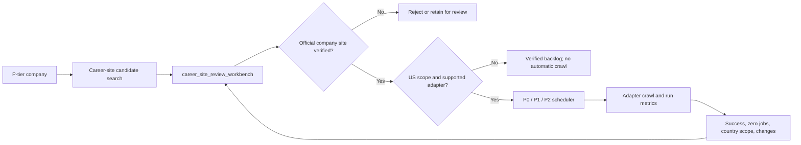

# Career-site discovery pilot

## Cohort and cost

The first pilot covers every consolidated company with `priority_score >= 4.5`:

- Companies: 103
- Successful searches: 103
- Effective pilot search credits: 103
- Additional cancelled dry-run searches: 26
- Total Tavily basic-search credits consumed: approximately 129
- Tavily basic search cost: one credit per company

No LLM or browser rendering is used. Tavily returns candidates; it does not
verify or enable them.

## Pilot result

After automatic removal of known aggregators and external job boards:

- Companies with candidates awaiting review: 100
- Companies with no retained candidate: 3
- Review candidates: 245
- Verified sites: 0 until human review
- Crawl-enabled sites: 0 until human review

Candidate source distribution:

| Source | Candidates |
|---|---:|
| Generic official-looking HTML | 210 |
| Workday | 21 |
| Greenhouse | 7 |
| iCIMS | 3 |
| Lever | 3 |
| SmartRecruiters | 1 |

## TablePlus review workflow

Open schema `jobpush`, then use only **`career_site_review_workbench`** for
human work. It is the canonical one-company-per-row surface and contains up to
three candidates plus the verified URL. It sorts:

1. manual P0 needing review;
2. verified manual P0 (kept visible, including Google);
3. Chicago + LinkedIn, Chicago, LinkedIn, large sponsors;
4. remaining score/diverse samples.

Review candidate 1 first. If it is wrong, inspect candidate 2 and candidate 3.
Migration 057 removed those redundant human-facing views. Candidate URLs are
already exposed as columns in `career_site_review_workbench`; use
`career_sites` only when a detailed one-row-per-URL audit is needed.

Confirm a site:

```sql
SELECT jobpush.review_career_site(
    12345, 'verified', 'nicole', 'Official company career or ATS site'
);
```

Reject a site:

```sql
SELECT jobpush.review_career_site(
    12345, 'rejected', 'nicole', 'Aggregator, wrong entity, or unrelated brand'
);
```

Replace `12345` with the candidate site ID shown in the review view. Confirming
a site enables it for future crawling and marks the company `found`. Rejecting
one candidate keeps the company in review while other candidates remain.

## Generalization loop

1. Human-review the 100 pilot companies.
2. Measure rank-1 precision and source-specific precision.
3. Add recurring false domains to
   `career_site_discovery_domain_excludes` and the Python deny list.
4. Add adapters for confirmed ATS sources.
5. Run a stratified 4.0/3.0/2.5 sample; only low-confidence candidates require
   human review.

Human review is a calibration sample, not a requirement for every company.
`career_site_review_precision` measures verified/rejected precision by source
type and candidate rank. Auto-verification may be enabled later only for a
narrow structured-ATS segment after it has enough reviewed examples and at
least 98% observed precision. Generic HTML and conflicting candidates remain
manual.

## Effective-tier expansion (2026-06-23)

The first expansion searched 150 never-searched P-tier companies, with manual
P0 first and high-score P1/P2 after it. It used 150 Tavily basic credits,
completed with zero search errors, and retained 381 candidates. The ranked
company review queue then contained 2 P0 and 221 P1 companies.

A second 50-company potential-P0 sample deliberately avoided alphabetical
selection. It stratified Chicago, LinkedIn Top Employer, large LCA sponsor, and
cross-score random groups. It retained 123 candidates with zero search errors;
examples include Ford, General Motors, Nike, Siemens, Bloomberg, Morningstar,
Medtronic, Deere, Motorola, Dropbox, and Chicago employers.

Known external aggregators such as TechFetch belong in both the database domain
exclude table and `scripts/discover_career_sites.py`; they must never be
verified as a company-owned career site.

`career_site_discovery_runs` records company counts, candidates, errors, and
estimated credits for every completed batch.

## P0/P1 monthly expansion policy (2026-06-24)

The operating goal is to make P0/P1 usable before spending time or credits on
P2. Use `db/run_discover_career_sites_p0_p1.sh` for the normal expansion path:

```bash
bash db/deploy_via_ssm.sh db/run_discover_career_sites_p0_p1.sh
```

That runner searches only enabled P0/P1 companies that have never had a
retained verified/unverified career-site candidate. It orders by effective tier
and then `priority_score DESC`, so the highest-scored P1 companies consume
credits first. The default batch cap is 600 companies / roughly 600 Tavily basic
search credits. Override with `DISCOVERY_LIMIT` only when running directly on
the EC2 host or after extending the deployment wrapper to pass environment
variables.

Do not run all P-tier companies automatically. Current constraints are:

- Tavily free Researcher plan is 1,000 credits/month.
- One basic search is approximately one credit per company.
- P1 alone is several thousand companies, so full P1 requires paid credits or
  multiple monthly resets.
- P2 remains paused until P0/P1 discovery, verification, adapter coverage, and
  dashboard monitoring are stable.

Human review is used to calibrate precision and mark high-value sites; it is
not expected to cover all P1 companies manually. Only promote narrow structured
ATS patterns to auto-verification after the precision gates in
`LEARNING_OPERATIONS.md` are satisfied.

If Tavily returns quota/authentication failures such as HTTP 432, stop the
batch immediately. `scripts/discover_career_sites.py` now aborts after three
consecutive fatal HTTP errors (401/402/403/429/432) instead of marking hundreds
of companies as failed. If an exhausted key accidentally marks companies
`retry`, run:

```bash
bash db/deploy_via_ssm.sh db/run_reset_tavily_quota_failures.sh
```

Check the active AWS-stored key without printing it:

```bash
bash db/deploy_via_ssm.sh db/run_tavily_usage_status.sh
```

### 2026-06-24 expansion runs

Two score-ordered expansion runs completed against P0/P1 demand before P2:

| Companies searched | Candidates retained | Search errors |
|---:|---:|---:|
| 640 | 1,629 | 0 |
| 980 | 2,475 | 0 |
| 980 | 2,357 | 0 |
| **2,600** | **6,461** | **0** |

After these runs, the P1 discovery state was 23 verified, 2,808 awaiting
candidate review, 55 not found, and 1,759 not yet searched. Each 980-company
run used a newly rotated independent Tavily account and reserved approximately
20 of its 1,000 free-plan credits based on request count.

Operational caveat: Tavily's `/usage` response still reported zero immediately
after the 980 successful searches. Treat request count as the conservative
credit ledger until the provider usage endpoint catches up; do not launch
another large batch merely because that endpoint temporarily shows unused
credits.

### 2026-06-24 / 2026-06-25 actual ledger

As of the latest audit:

| Metric | Count |
|---|---:|
| Successful discovery searches retained in DB | 2,903 |
| Retained career-site candidates | 7,251 |
| P1 companies with any retained candidate or verified site | 2,829 |
| P1 companies with verified / crawl-enabled site | 724 |
| P1 companies still pending discovery | 1,756 |
| P1 companies with candidates awaiting review / later decision | 2,105 |
| P1 companies not found | 55 |

The important distinction: a Tavily discovery search produces *candidate URLs*.
It does not automatically mean the company has a safe, adapter-supported,
US-scoped career site. Most retained candidates are `generic_html`; those are
kept for review or later generic parsing but are not automatically enabled for
daily crawl. Rank-1 structured ATS candidates are auto-trusted only for
supported adapters:

```bash
bash db/deploy_via_ssm.sh db/run_apply_career_site_auto_trust.sh
```

2026-06-25 update after key rotation: an additional 950 P0/P1 companies were
searched, retaining 2,237 candidates with zero provider errors. Auto-trust
promoted 209 rank-1 structured ATS sites. P1 coverage reached 933 enabled
sites, with 347 successfully crawled so far.

## Tavily credential storage and rotation

The active Tavily key is stored only in AWS Secrets Manager:

- secret: `joblens/app`
- JSON field: `TAVILY_API_KEY`
- region: `us-east-2`

It must not be committed to this repository, pasted into documentation, or
stored as plaintext on EC2. Discovery runners retrieve it at runtime and unset
the process variable after the search finishes.

Rotate the key from an authenticated local terminal with:

```bash
bash db/rotate_tavily_key.sh
```

The script reads the key without echoing it, verifies it against Tavily's usage
endpoint, preserves all other fields in `joblens/app`, and creates a new AWS
Secrets Manager version. A newly registered free account should report its own
independent plan usage. Check remaining credits before choosing a batch size;
keep a small reserve for validation and retries.

## Discovery-to-crawl flow



Human review calibrates discovery precision; it is not a requirement to review
every company forever. Structured ATS groups may become auto-verifiable only
after the sample and precision gates in `LEARNING_OPERATIONS.md` are met.

## Reusing historical Tavily data

Historical site-discovery calls did not archive Tavily's full JSON response.
The durable fields are candidate URL/domain, ATS type, evidence title/snippet,
rank, score, and verification/crawl outcomes. Migration 069 aggregates those
already-paid-for fields in `jobpush.company_tavily_discovery_features`; this
costs zero new credits and remains useful for website coverage analysis.

The separate Tavily company-profile enrichment pilot was removed in migration
073 after review. Do not spend Tavily credits on broad industry/size/headquarters
enrichment unless there is a concrete priority rule that will use the field.
