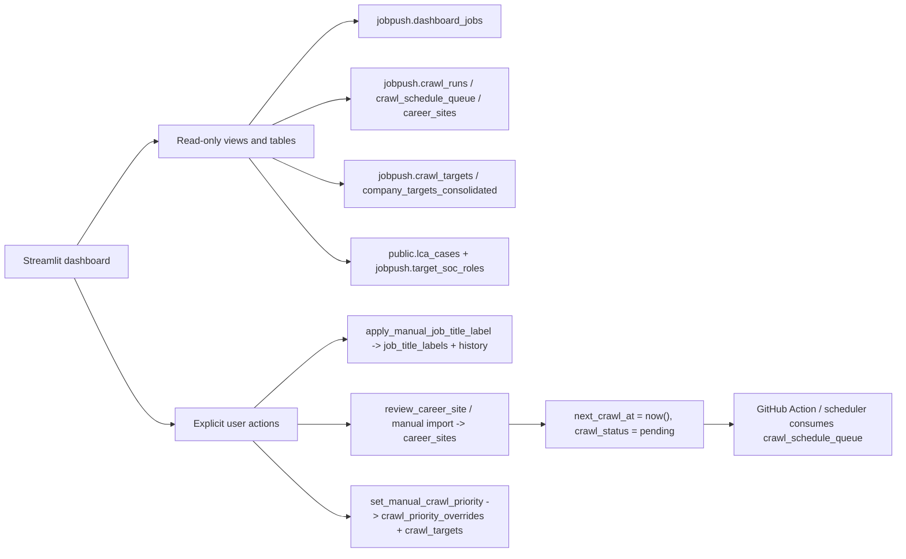

# JobPush Ops dashboard

The dashboard is a private Streamlit app running on the existing EC2 host and
reading the existing private RDS database. The production browser entry point
is the Caddy-proxied HTTPS URL with basic auth:

```text
https://jobpush.3-128-164-130.sslip.io
```

The Streamlit process itself still binds locally on EC2 at `127.0.0.1:8501`.
For emergency/private access without the public proxy, open an SSM tunnel from
the repository directory:

```bash
bash deploy/open_dashboard_tunnel.sh
```

Keep that terminal open, then visit <http://127.0.0.1:8501>. This uses the same
AWS/SSM access already used for database deployment and does not require a
Codex token.

## Current pages and interaction model

- **Pulse** is the default landing page. It shows top-line selected-tier job
  counts, 30-day target discovery, and P0/P1/P2/P3 crawl rollout;
- selected-tier crawl completion: total companies, companies with enabled sites,
  ever-succeeded companies, due/unfinished sites, attempted-today count, and
  latest crawl start time;
- today's active-US new target / needs-review jobs, US closed jobs, crawl runs,
  and failures;
- **Jobs to apply**: fast selected-tier active US `target` job list with direct
  links, sorted newest first and controlled by date/company/title/location,
  track, role family, and employment filters;
- the global row limit is selectable (default 1,000; raise only for export) so
  the main application page does not freeze on large crawl days;
- SQL expanders on the job and crawl-rollout pages so Nicole can see the core
  read queries without opening the repo;
- CSV download for the current filtered job view, segmented job view, track
  summary, and one-company job list;
- downloadable 100/250/500/1,000/2,000-title classifier-improvement batches;
- a small global sidebar for date range, P-tier, and row limit only.
  Company/title/location filtering lives inside the pages that need it,
  especially **Jobs to apply**;
- one-company lookup for networking/application planning, including active
  official-site jobs, LCA sponsorship role aggregates, CSV download, and a
  LinkedIn company-search shortcut;
- **Title review**: selectable review table. One or more selected rows can be
  labeled as `target`, `non_target`, or `review` through
  `jobpush.apply_manual_job_title_label(...)`; every write keeps history. A
  batch editor remains available as a backup for spreadsheet-style edits;
- **Site review**: separate in-page candidate review. Existing candidates can
  be verified/rejected without TablePlus. Selecting a company row drives the
  panels below it: LCA sponsorship roles, P-tier override, candidate
  verify/reject, and manually imported official career URL. Manual URL import
  no longer requires typing the company name again. This page is an override
  surface: pending candidates and already verified/auto-trusted sites can both
  be shown. Every discovery source, including direct ATS guessing
  (`discovery_source='ats_url_guess'`), can expose up to three candidate URLs;
- newly verified/imported career sites are marked `next_crawl_at = now()` and
  `crawl_status = 'pending'`. The dashboard host sets
  `JOBPUSH_ENABLE_INLINE_CRAWL=1`, so the app immediately attempts to crawl the
  specific verified/imported `site_id` via `SITE_ID_FILTER`; if inline crawl is
  disabled, the scheduler/GitHub Action picks it up from `crawl_schedule_queue`;
- **Scoring rules** page showing P0/P1/P2/P3 definitions, score components, the
  company-to-schedulable-site coverage funnel, score distributions, and the
  relationship between LCA/SOC target labels and `target_role_score`; SOC and
  raw-title review tables support multi-row selection and CSV export;
- personal saved/apply-next/applied/dismissed workflow;
- **Crawl monitor** includes rollout coverage, blocker distributions, adapter
  health, recent run logs, failed run details, and active alerts;
- P0/P1/P2/P3 company-level scoring tables and all priority-score distributions;
- separate human-verified and system-auto-trusted site coverage.

The dashboard covers all monitored companies. `first_seen_at` and daily
boundaries are displayed using America/Chicago so "today" is consistent with
Nicole's working timezone; this is not a Chicago-company filter.
Application decisions live in `jobpush.job_application_actions`; title target
classification and personal application state remain separate.

The top-line job metrics use `jobpush.job_postings_us`, so non-US title-language
signals and inactive/closed postings do not inflate Nicole's daily recommendation
counts. If you want to audit the classifier, include `Needs review` in the
sidebar; the default recommendation view intentionally shows `target` only.

Home vocabulary:

- `Open target jobs`: active US jobs currently classified as target and still
  in `new`, `saved`, or `apply_next` application states.
- `Newly discovered today`: postings JobPush first inserted today. This is not
  necessarily the employer's posting date, so it can spike after a large crawl
  or classifier reclassification.
- `Closed today`: postings that disappeared from a later crawl snapshot today.

Dashboard vocabulary:

- `target`: recommended to consider applying, based on manual labels, shared
  profile rules, SOC evidence, and high-confidence learned rules.
- `Needs review`: the system does not have enough confidence yet. These rows
  are for sampling and improving rules/model behavior, not for Nicole to judge
  every day before applying.
- `Excluded / non-target`: known out-of-scope roles. The dashboard keeps them
  visible only when explicitly selected for audit.
- `Closed jobs`: jobs that were previously active for the same career site but
  disappeared from a later snapshot. JobPush does not crawl the entire database
  every day; only scheduled/due enabled sites are refreshed.

Application status is a personal workflow, not a classifier: `new` means no
application decision, `saved` is an interesting bookmark, `apply_next` is the
shortlist, `applied` means submitted, and `dismissed` means intentionally
skipped. The dashboard explains these values in the Application queue tab.

`role_stack` / `role_family` are dashboard-level convenience groupings derived
from `job_title_labels.classification_status`, `canonical_role`, and title text.
Rows classified as `non_target` are displayed as `Excluded / non-target` instead
of being mixed into product-manager/software/data summaries. If the stack-1/2/3
taxonomy becomes a durable product rule, promote it into
`jobpush.job_title_labels` or a versioned config file instead of treating this
display rule as source of truth.

`Other` means the posting is still a target/review posting, but the dashboard
display layer has not mapped its title or canonical role into a more specific
role family yet. It is a grouping gap, not a crawler failure.

## Data retrieval and writeback chain



Dashboard actions are database operations, not silent code edits:

| Dashboard action | Writes database? | Changes repo code? | Triggers crawl? | Affects ML/rules? |
|---|---:|---:|---:|---:|
| Mark title `target` / `non_target` / `review` | Yes, `job_title_labels` + history | No | No | It becomes training/evaluation data immediately |
| Verify/reject a candidate site | Yes, `career_sites` | No | Verified site is marked due now and inline crawl targets that `site_id` when enabled | No |
| Import official career URL | Yes, `career_sites` and crawl target status | No | Marked due now and inline crawl targets that `site_id` when enabled | No |
| Override P0/P1/P2 or clear override | Yes, `crawl_priority_overrides` + `crawl_targets` | No | No direct crawl, but priority affects queue ordering/frequency | No |
| Add new hard title rule | Via migration/config | Yes, when committed | No | Yes, updates deterministic rule layer |
| Add/fix adapter | No by itself | Yes, script/migration commit | Yes after deployment and schedule | No |

Because the dashboard cannot safely rewrite repository code from a button click,
recurring title patterns and adapter fixes must still become versioned commits
and migrations. This keeps rollback/audit possible. Human labels collected in
the dashboard are the evidence used to propose those code/rule changes.

## Streamlit boundary

Streamlit is good enough for this internal operations console because it gives
fast database-backed tables, downloads, forms, and basic drill-downs. It is not
a full product frontend. Current limitations:

- `st.metric` is not itself clickable; use the tables below the metric row for
  operational drill-downs such as recent crawl runs and coverage.
- Page state is preserved with a radio/pill navigation control instead of native
  `st.tabs`, because Streamlit reruns the script after every form/button action
  and native tabs can jump back unexpectedly.
- Fine-grained table editing, keyboard shortcuts, custom row menus, and fully
  polished visual design are limited.
- If JobPush becomes a daily user-facing application, keep Streamlit for admin
  ops and build a small React/Next.js frontend for application workflow.

## Deployment

```bash
bash deploy/install_dashboard_via_ssm.sh
```

The service is `jobpush-dashboard.service`. A later public-URL phase may add
Google OIDC and HTTPS, but must retain an explicit email allowlist before any
public network exposure.

## Public dashboard URL

The private Streamlit process runs on EC2 at `127.0.0.1:8501`. For browser
access without an SSM tunnel, expose it through the host Caddy reverse proxy:

```bash
bash deploy/expose_dashboard_via_caddy.sh
```

Current production URL:

```text
https://jobpush.3-128-164-130.sslip.io
```

Use basic auth. Do not commit the plaintext password; rotate by rerunning the
script with `DASHBOARD_PASSWORD=...`.
