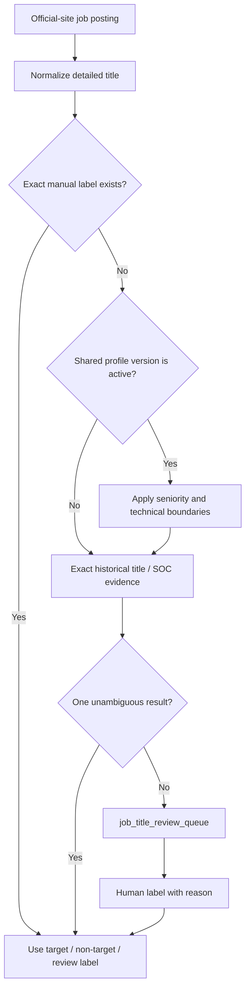

# Detailed job-title labeling

Official career sites produce much more detailed titles than the historical
LCA/SOC workbook. JobPush therefore uses two layers:

1. Exact normalized-title matches against `soc_role_title_mappings` are
   classified automatically by migration 046.
2. Unmatched or SOC-conflicting titles remain in
   `jobpush.job_title_review_queue` for human review.
3. Explicit personal profile rules are applied before the review queue. The
   `profile-title-rules-v1` trigger classifies obvious target tracks and avoid
   tracks for both existing and newly crawled titles. Exact manual labels always
   win.

## Human workflow

The editable workbook is generated from the production review queue, ordered
by active posting count and company count. Only these columns should be edited:

- `人工判断（请填写）`: `target`, `non_target`, or `review`
- `标准岗位（可选）`
- `判断原因/备注（可选）`

Do not edit `normalized_title`; it is the database key. Start with `HIGH`, then
`MEDIUM`. It is not necessary to label the long tail in one session.

- `HIGH`: at least 5 active postings, or present at 3 or more companies
- `MEDIUM`: at least 2 active postings
- `LATER`: one active posting and fewer than 3 companies

Returned decisions are applied with:

```sql
SELECT jobpush.apply_manual_job_title_label(
    'normalized title', 'target', 'Canonical role', 'Reason', 'nicole'
);
```

Manual decisions use `rule_version = 'manual-v1'`, override automatic rules,
and append an immutable row to `job_title_label_history`.

## Current production snapshot (2026-06-24)

- Automatically classified target titles: 111
- Automatically classified non-target titles: 100
- Manual title labels imported: 669 total (`target` 199, `non_target` 470)
- Profile-rule titles: 1,319 target and 811 non-target from
  `profile-title-rules-v1`, plus 5,520 prior hard-boundary non-target titles
- Remaining distinct review titles: 11,328
- Active US postings represented by review titles: 6,494
- Active US target postings: 1,712
- First labeling tranche (`HIGH`): 171 titles
- Second editable tranche: 500 titles, generated after publishing the hard
  exclusions and ordered by active posting/company frequency.

The export query is `db/analysis/export_job_title_review.sql`.
The private dashboard can also export a fresh review batch without Codex.

## Why Product Manager and Software Engineer appeared in review

The first pipeline intentionally used exact LCA/SOC evidence only. Titles such
as `software engineer` and `product manager` map to multiple SOC families in the
historical LCA file, including both target and non-target categories, so the
system left them in review rather than guessing. That was safe for a pilot but
too conservative for scale.

Migration 064 turns the shared profile into executable title rules:

- product/product-owner/product-marketing titles -> target;
- software, full-stack, backend/frontend, data, BI, systems analyst, solution
  architecture/engineering -> target;
- applied AI / GenAI / LLM application, customer success / technical account,
  and selected marketing analyst/specialist titles -> target;
- HR/recruiting, accounting/tax/audit, retail/in-store/Xfinity sales,
  warehouse, manufacturing-floor roles, hardware, mechanical/electrical,
  embedded/firmware/chip/CAD/EDA, ML-model roles, and over-senior titles ->
  non-target;
- CJK/Korean language signals are marked non-target and any active postings
  with those title signals are excluded from the US business surface.

This is still a deterministic classifier, not semantic AI. It fixes repeated
obvious cases while leaving ambiguous cases for human review or the planned AI
proposal layer.

Personal technical and seniority boundaries come from the shared JobLens
candidate profile, not from SOC alone. See
[`SHARED_JOB_SEARCH_PROFILE.md`](SHARED_JOB_SEARCH_PROFILE.md).

## Classification flow



Manual labels always win. A draft profile never activates broad exclusions;
unresolved titles stay in review.
