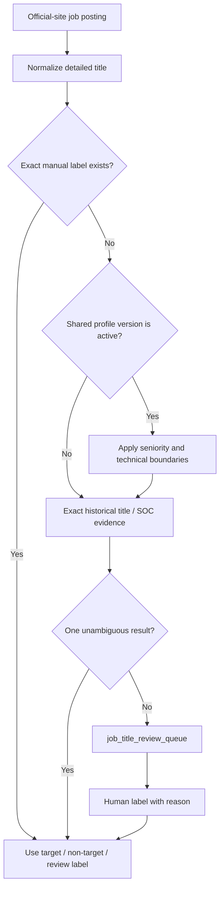

# Detailed job-title labeling

Official career sites produce much more detailed titles than the historical
LCA/SOC workbook. JobPush therefore uses two layers:

1. Exact normalized-title matches against `soc_role_title_mappings` are
   classified automatically by migration 046.
2. Unmatched or SOC-conflicting titles remain in
   `jobpush.job_title_review_queue` for human review.
3. Explicit personal profile rules are applied before the review queue. The
   `profile-title-rules-v2` trigger classifies obvious target tracks and avoid
   tracks for both existing and newly crawled titles. Exact manual labels
   usually win, except when a newer hard profile exclusion is intentionally
   applied to avoid re-promoting a known out-of-scope title family.
4. Remaining ambiguous titles can be sent to the audited AI classifier. High
   confidence AI decisions are applied only when the title is still `review` and
   is not a manual label.

## Human workflow

The editable workbook is generated from the production review queue, ordered
by active posting count and company count. Only these columns should be edited:

- `人工判断（请填写）`: `target`, `non_target`, or `review`
- `标准岗位（可选）`
- `判断原因/备注（可选）`

Do not edit `normalized_title`; it is the database key. Start with `HIGH`, then
`MEDIUM`. It is not necessary to label the long tail in one session.

- `HIGH`: at least 5 active postings, or present at 3 or more companies
- `MEDIUM`: at least 2 active postings
- `LATER`: one active posting and fewer than 3 companies

Returned decisions are applied with:

```sql
SELECT jobpush.apply_manual_job_title_label(
    'normalized title', 'target', 'Canonical role', 'Reason', 'nicole'
);
```

Manual decisions use a `manual-*` rule version and append an immutable row to
`job_title_label_history`. The 2026-06-27 round-1 import uses
`manual-title-review-2026-06-27`; the round-2 import uses
`manual-title-review-round2-2026-06-27`. Target rows that conflict with hard
profile exclusions, such as any Senior/Sr title, are kept non-target.

## Current production snapshot

- Active profile-rule version: `profile-title-rules-v2`, backed by
  `jobpush.profile_title_rule_terms` instead of hard-coded SQL-only regexes.
- 2026-06-27 Nicole round-1 workbook import: 95 reviewed titles were applied
  (`target` 7 after hard-rule overrides, `non_target` 88).
- 2026-06-27 Nicole round-2 workbook import:
  `target` 20 and `non_target` 62 exact normalized-title labels were applied.
- 2026-06-27 Nicole round-3 dashboard CSV import:
  `target` 117 and `non_target` 383 exact normalized-title labels were applied.
- 2026-06-27 profile expansion added hard non-target families for healthcare /
  clinical roles, legal roles, teaching / education roles, skilled-trade roles,
  buyer / procurement roles, restaurant / food-service roles, plumbing trades,
  mental-health / therapy roles, lab / specimen / clinical-support roles,
  retail stylist / beauty / selling-floor roles, and non-technical sales roles.
  This removes repeated obvious misses from future review batches.
- 2026-06-27 profile update `profile-title-rules-v2`: all Senior/Sr titles are
  a hard `non_target` exclusion across every track. This supersedes the earlier
  narrower senior-SDE-only rule and intentionally overrides older manual target
  labels if the normalized title contains `senior`, `sr`, or `sr.`.
- 2026-06-27 local supervised title model retrain after round 3 used 1,346
  manual labels. Baseline Naive Bayes met the 98% precision gate only for
  `non_target` at threshold 0.995 and applied 457 additional high-confidence
  non-target decisions. It did not apply target predictions because target
  holdout precision remained too low.
- Active US postings after the 2026-06-27 round-3 import and local ML pass:
  roughly `target` 4.3k, `review` 14.2k before ML / 13.7k after ML, and
  `non_target` 21.6k+.
- The private dashboard can export a fresh review batch without Codex.

The export query is `db/analysis/export_job_title_review.sql`.
The private dashboard can also export a fresh review batch without Codex.

## Why Product Manager and Software Engineer appeared in review

The first pipeline intentionally used exact LCA/SOC evidence only. Titles such
as `software engineer` and `product manager` map to multiple SOC families in the
historical LCA file, including both target and non-target categories, so the
system left them in review rather than guessing. That was safe for a pilot but
too conservative for scale.

Migrations 064–065 turn the shared profile into executable title rules. Version
2 moves the term inventory into `jobpush.profile_title_rule_terms`, so future
YAML/profile updates should publish a new rule table version rather than burying
all logic in one SQL function:

- product/product-owner/product-marketing titles -> target;
- software, full-stack, backend/frontend, data, BI, systems analyst, solution
  architecture/engineering -> target;
- applied AI / GenAI / LLM application, customer success / technical account,
  and selected marketing analyst/specialist titles -> target;
- HR/recruiting, accounting/tax/audit, retail/in-store/Xfinity sales,
  warehouse, manufacturing-floor roles, restaurant / food-service roles,
  buyer / procurement roles, plumbing trades, therapy / psychiatry /
  mental-health roles, lab / specimen / clinical-support roles, hardware,
  mechanical/electrical, embedded/firmware/chip/CAD/EDA, ML-model roles,
  healthcare/clinical roles, legal roles, teaching/education roles,
  skilled-trade roles, any Senior/Sr title, and over-senior titles -> non-target;
- CJK/Korean language signals are marked non-target and any active postings
  with those title signals are excluded from the US business surface.

This deterministic classifier fixes repeated obvious cases. Semantic AI is now
available as an audited batch layer through
`jobpush.job_title_ai_classifications`; it is not allowed to overwrite manual
labels and should not be run as a blocking step after every crawl.

## AI classifier operating rule

Run small batches first:

```bash
bash db/deploy_via_ssm.sh db/run_ai_title_classification_batch.sh
```

The runner reads `LLM_API_KEY`, `LLM_BASE_URL`, and `LLM_MODEL` from the
`joblens/app` AWS secret. As of 2026-06-24 the configured model is
OpenRouter `openai/gpt-oss-20b:free`; it hit the free daily/request limit during
the first 300-title attempt and returned occasional malformed JSON. Therefore
the default AI batch is capped at 50 while that free model is configured. For
production-scale review reduction, switch the secret to a stable paid model/key
and then increase the batch size gradually.

Confidence gates:

- target applies at confidence ≥ 0.88;
- non-target applies at confidence ≥ 0.84;
- lower-confidence output remains `review`.

2026-06-27 profile update: Senior/Sr titles are non-target across all tracks
even when the base role family would otherwise be target. Examples include
Senior Software Engineer, Sr Backend Engineer, Senior Data Engineer, Senior
Product Manager, Senior Business Analyst, and Sr Customer Success Manager.

The AI table records model, prompt version, profile version, input hash,
rationale, and raw JSON response for debugging.

Personal technical and seniority boundaries come from the shared JobLens
candidate profile, not from SOC alone. See
[`SHARED_JOB_SEARCH_PROFILE.md`](SHARED_JOB_SEARCH_PROFILE.md).

## Classification flow



Manual labels always win. A draft profile never activates broad exclusions;
unresolved titles stay in review.
