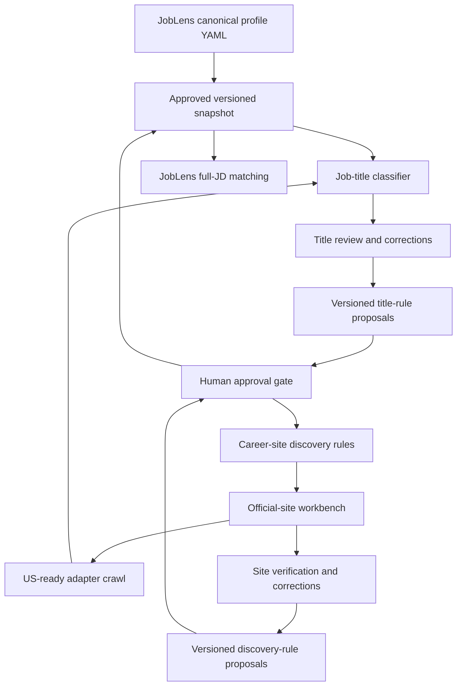

# Learning and review operations

This is the operating calendar for two separate business loops:

1. discovering and validating official career sites;
2. classifying whether crawled jobs match the shared job-search profile.

They share approved human feedback, but keep separate rules, metrics, and
rollback controls.

## Calendar

| Date / cadence | Job-title work | Career-site work |
|---|---|---|
| 2026-06-23 | Imported 171 HIGH labels; retained exact-label history | Completed 150-company expansion and 50-company potential-P0 sample |
| 2026-06-30 | Audit ML/hardware/seniority false-positive clusters and profile questions | Review P0, then Chicago/LinkedIn/large-sponsor candidates; calculate precision |
| 2026-07-07 | Second weekly audit; compare unresolved and override rates | Audit structured ATS decisions and wrong-company/domain patterns |
| 2026-07-23 | Monthly activation-readiness review for shared profile | Decide whether any structured-ATS segment qualifies for controlled auto-verification |
| Hourly | No human action; title rules run only after a crawl | GitHub Actions checks due sites; requests follow P0=24h, P1=72h, P2=168h |
| Weekly while new | Review highest-volume unresolved and regressions | Review new P0/potential-P0 candidates and alerts |
| Monthly after stable | Drift and 5–10% audit sample | Precision, adapter health, US scope, and 5–10% auto-decision audit |

## Activation gates

| Rule type | Minimum evidence | Required precision | Human approval | Automatic rollback signal |
|---|---:|---:|---|---|
| Job-title generalization | 20 labeled examples | 98% | Required | Manual override spike or holdout regression |
| Structured ATS auto-verification | 30 reviewed candidates per narrow segment | 98% | Required | Wrong company, domain conflict, or repeated failure |
| Generic HTML verification | Not eligible | N/A | Always manual | N/A |
| New adapter expansion | Two idempotent representative runs | 100% pilot success | Required | Parse zero, country-scope regression, repeated failure |

## How the system learns

JobPush uses the following learning layers, in this order:

1. **Exact human labels** (`manual-v1`) from Nicole's review workbooks. These
   are immutable audit evidence and always override system rules.
2. **Deterministic profile rules** (`profile-title-rules-v2`) compiled from the
   shared candidate profile and repeated manual-label clusters. This handles
   obvious target/avoid cases such as Product Manager, Software Engineer, HR,
   accounting, warehouse/retail, manufacturing floor, hardware, and non-US
   language signals.
3. **Local label learning**. Exact reviewed titles are remembered immediately.
   Repeated word/phrase clusters from manual labels are evaluated on a holdout
   set and may propose deterministic rules only after the precision gate is
   met. This requires no paid model API. Ambiguous rows remain `review` rather
   than being guessed.
4. **Optional semantic fallback** (`ai-title-classifier-v1`). The audited
   OpenAI-compatible path exists for experiments, but it is not required and
   is not part of the normal production pipeline. If disabled, rules + local
   label learning remain the complete classifier path.
5. **Release gate**. A proposed rule or model prompt becomes active only after
   a versioned migration/config update, metrics, and rollback plan.

This means YAML is not just documentation. It must be compiled into either a
deterministic rule snapshot or an AI prompt/config snapshot. Editing YAML alone
does not change production behavior until that publish step happens.

## Optional AI path (disabled by default)

JobPush contains an audited experimental classifier that can reuse JobLens'
OpenAI-compatible configuration. It is optional; normal crawls do not depend on
it and no paid key is required. If it is ever enabled, it must:

- read the canonical candidate profile snapshot;
- accept title, company/source context, location, category, and eventually
  description snippets;
- return `target`, `non_target`, or `review`, plus track, confidence, and
  explanation;
- never override manual labels;
- write model version, prompt version, profile version, and input hash for audit;
- sample low-confidence and high-impact decisions back into the review workbook.

On 2026-06-24 the free-model experiment hit rate limits and malformed JSON.
The production decision is therefore to keep this path off and use human-label
memory, deterministic rules, and locally evaluated generalizations.

AI is for semantic generalization and proposal generation; deterministic rules
remain cheaper, faster, and safer for obvious strings.

## Metrics retained for every review

- profile/rule version and activation date;
- examples, coverage, precision, false positives, and false negatives;
- manual override and unresolved rates;
- source type, candidate rank, company tier, and domain for website decisions;
- crawl requests, latency, parsed/new/closed jobs, failures, and US scope;
- reviewer, review date, next audit date, and rollback reason.

No model output is allowed to promote itself into an active rule. The system
may generate a proposal and evidence bundle; a human approves the versioned
change.

### Offline supervised title model

Migration 072 and `scripts/train_local_title_classifier.py` implement a
dependency-free multinomial Naive Bayes classifier over normalized title word
unigrams and bigrams. Titles are case-folded, so `Engineer`, `engineer`, and
`ENGINEER` are equivalent. It trains only on audited `manual%`
target/non-target labels, evaluates deterministic five-fold holdouts, and
selects class-specific confidence thresholds only when holdout precision is at
least 98% with enough examples. On 2026-06-27, quick experiments with simple
suffix stems and character n-grams did not pass the 98% holdout gate, so they
were not kept as production features. Future tuning should compare feature
sets and model families in a report before changing production behavior.

`scripts/evaluate_title_classifier_variants.py` and
`db/run_title_model_tuning_report.sh` produce that report. After Nicole's
round-3 500-title review, the baseline model trained on 1,346 manual labels.
It achieved 98.39% precision for high-confidence `non_target` predictions at
threshold 0.995, but target precision was only 80% even at threshold 0.995.
Therefore production still auto-applies only high-confidence non-target
predictions; target recommendations should continue to come from exact manual
labels and deterministic profile rules until a stronger model passes the gate.

Eligible predictions are written to `job_title_ml_classifications` with model
version, training size, holdout metrics, confidence, and evidence features.
They may fill only unresolved `review` titles; manual labels and hard profile
rules remain authoritative. This path uses no paid API and never sends title or
profile data outside the database host.

## Current TODO

| Owner | Due | Task | Status |
|---|---|---|---|
| Nicole | 2026-06-23 | Answer or revise the five `open_questions` in the JobLens YAML | Completed |
| Codex | 2026-06-28 | Track and fix title-review leakage after P1 expansion: leader/cleaner/merchant/non-US market markers should not reach human review | Migrations 089–090 added; audit reduced monitored leakage from 452 suspect review titles to 1 conservative exception |
| Codex | 2026-06-30 | Build the first holdout report from the 171 HIGH labels; propose rules without activating them | Pending |
| Nicole | Ongoing | Review `career_site_review_workbench`, starting with P0 then potential-P0 signals | In progress |
| Codex | 2026-06-30 | Report website precision by source type and candidate rank | Pending |
| Codex | 2026-06-24 | Add first AI classifier using JobLens OpenAI config for ambiguous titles | Experimental only; disabled by default |
| Codex | 2026-06-30 | Implement next structured ATS adapters, starting with Lever/Ashby/SmartRecruiters by volume and API stability | Implemented; rollout health monitoring in progress |
| Codex | After profile approval | Implement immutable snapshot publisher in JobLens and versioned loader in JobPush | Blocked on approval |
| Nicole + Codex | After successful evaluation | Change profile from draft to active and explicitly decide whether to run owner sync | Blocked on evaluation |
| Codex | 2026-07-23 | Produce monthly drift, override, unresolved-title, adapter, and country-scope report | Scheduled |
