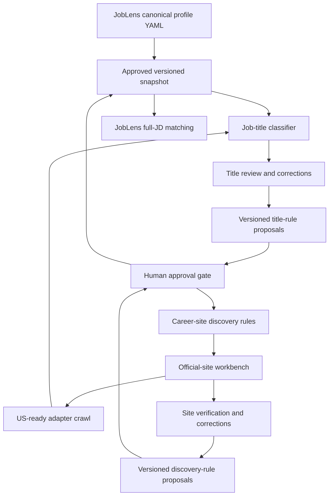

# Learning and review operations

This is the operating calendar for two separate business loops:

1. discovering and validating official career sites;
2. classifying whether crawled jobs match the shared job-search profile.

They share approved human feedback, but keep separate rules, metrics, and
rollback controls.

## Calendar

| Date / cadence | Job-title work | Career-site work |
|---|---|---|
| 2026-06-23 | Imported 171 HIGH labels; retained exact-label history | Completed 150-company expansion and 50-company potential-P0 sample |
| 2026-06-30 | Audit ML/hardware/seniority false-positive clusters and profile questions | Review P0, then Chicago/LinkedIn/large-sponsor candidates; calculate precision |
| 2026-07-07 | Second weekly audit; compare unresolved and override rates | Audit structured ATS decisions and wrong-company/domain patterns |
| 2026-07-23 | Monthly activation-readiness review for shared profile | Decide whether any structured-ATS segment qualifies for controlled auto-verification |
| Hourly | No human action; title rules run only after a crawl | EC2 checks due sites; requests follow P0=24h, P1=72h, P2=168h |
| Weekly while new | Review highest-volume unresolved and regressions | Review new P0/potential-P0 candidates and alerts |
| Monthly after stable | Drift and 5–10% audit sample | Precision, adapter health, US scope, and 5–10% auto-decision audit |

## Activation gates

| Rule type | Minimum evidence | Required precision | Human approval | Automatic rollback signal |
|---|---:|---:|---|---|
| Job-title generalization | 20 labeled examples | 98% | Required | Manual override spike or holdout regression |
| Structured ATS auto-verification | 30 reviewed candidates per narrow segment | 98% | Required | Wrong company, domain conflict, or repeated failure |
| Generic HTML verification | Not eligible | N/A | Always manual | N/A |
| New adapter expansion | Two idempotent representative runs | 100% pilot success | Required | Parse zero, country-scope regression, repeated failure |

## Metrics retained for every review

- profile/rule version and activation date;
- examples, coverage, precision, false positives, and false negatives;
- manual override and unresolved rates;
- source type, candidate rank, company tier, and domain for website decisions;
- crawl requests, latency, parsed/new/closed jobs, failures, and US scope;
- reviewer, review date, next audit date, and rollback reason.

No model output is allowed to promote itself into an active rule. The system
may generate a proposal and evidence bundle; a human approves the versioned
change.
