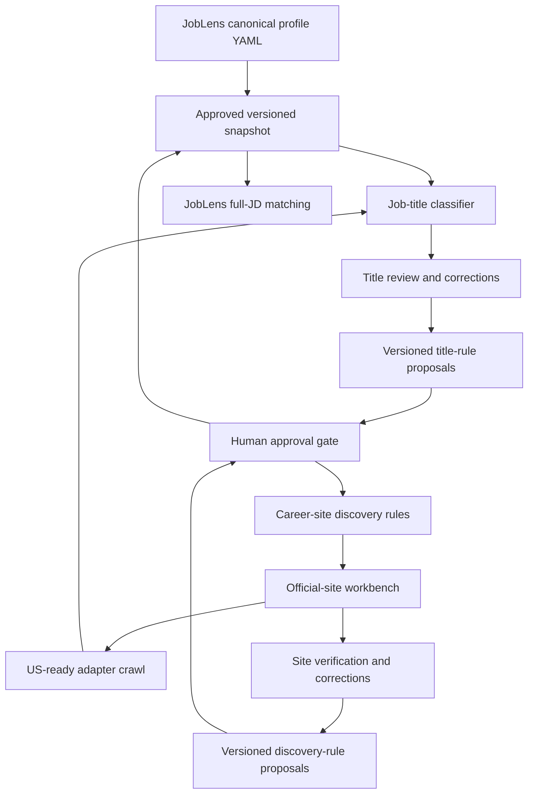

# Learning and review operations

This is the operating calendar for two separate business loops:

1. discovering and validating official career sites;
2. classifying whether crawled jobs match the shared job-search profile.

They share approved human feedback, but keep separate rules, metrics, and
rollback controls.

## Calendar

| Date / cadence | Job-title work | Career-site work |
|---|---|---|
| 2026-06-23 | Imported 171 HIGH labels; retained exact-label history | Completed 150-company expansion and 50-company potential-P0 sample |
| 2026-06-30 | Audit ML/hardware/seniority false-positive clusters and profile questions | Review P0, then Chicago/LinkedIn/large-sponsor candidates; calculate precision |
| 2026-07-07 | Second weekly audit; compare unresolved and override rates | Audit structured ATS decisions and wrong-company/domain patterns |
| 2026-07-23 | Monthly activation-readiness review for shared profile | Decide whether any structured-ATS segment qualifies for controlled auto-verification |
| Hourly | No human action; title rules run only after a crawl | GitHub Actions checks due sites; requests follow P0=24h, P1=72h, P2=168h |
| Weekly while new | Review highest-volume unresolved and regressions | Review new P0/potential-P0 candidates and alerts |
| Monthly after stable | Drift and 5–10% audit sample | Precision, adapter health, US scope, and 5–10% auto-decision audit |

## Activation gates

| Rule type | Minimum evidence | Required precision | Human approval | Automatic rollback signal |
|---|---:|---:|---|---|
| Job-title generalization | 20 labeled examples | 98% | Required | Manual override spike or holdout regression |
| Structured ATS auto-verification | 30 reviewed candidates per narrow segment | 98% | Required | Wrong company, domain conflict, or repeated failure |
| Generic HTML verification | Not eligible | N/A | Always manual | N/A |
| New adapter expansion | Two idempotent representative runs | 100% pilot success | Required | Parse zero, country-scope regression, repeated failure |

## How the system learns

JobPush now has four learning layers, in this order:

1. **Exact human labels** (`manual-v1`) from Nicole's review workbooks. These
   are immutable audit evidence and always override system rules.
2. **Deterministic profile rules** (`profile-title-rules-v1`) compiled from the
   shared candidate profile and repeated manual-label clusters. This handles
   obvious target/avoid cases such as Product Manager, Software Engineer, HR,
   accounting, warehouse/retail, manufacturing floor, hardware, and non-US
   language signals.
3. **AI proposal layer** (planned). JobPush should call the same OpenAI setup
   used by JobLens, classify ambiguous titles/JDs with structured JSON, and
   produce proposed labels plus reasons. Model output should enter review or a
   holdout report first; it must not silently overwrite `manual-v1`.
4. **Release gate**. A proposed rule or model prompt becomes active only after
   a versioned migration/config update, metrics, and rollback plan.

This means YAML is not just documentation. It must be compiled into either a
deterministic rule snapshot or an AI prompt/config snapshot. Editing YAML alone
does not change production behavior until that publish step happens.

## AI integration plan

When the deterministic queue stops yielding obvious wins, add a JobPush title/JD
classifier that reuses JobLens' OpenAI configuration and secret instead of
creating a separate JobPush key. The classifier should:

- read the canonical candidate profile snapshot;
- accept title, company, source URL, location, category, and description snippet;
- return `target`, `non_target`, or `review`, plus track, confidence, and
  explanation;
- never override manual labels;
- write model version, prompt version, profile version, and input hash for audit;
- sample low-confidence and high-impact decisions back into the review workbook.

AI is for semantic generalization and proposal generation; deterministic rules
remain cheaper, faster, and safer for obvious strings.

## Metrics retained for every review

- profile/rule version and activation date;
- examples, coverage, precision, false positives, and false negatives;
- manual override and unresolved rates;
- source type, candidate rank, company tier, and domain for website decisions;
- crawl requests, latency, parsed/new/closed jobs, failures, and US scope;
- reviewer, review date, next audit date, and rollback reason.

No model output is allowed to promote itself into an active rule. The system
may generate a proposal and evidence bundle; a human approves the versioned
change.

## Current TODO

| Owner | Due | Task | Status |
|---|---|---|---|
| Nicole | 2026-06-23 | Answer or revise the five `open_questions` in the JobLens YAML | Completed |
| Codex | 2026-06-30 | Build the first holdout report from the 171 HIGH labels; propose rules without activating them | Pending |
| Nicole | Ongoing | Review `career_site_review_workbench`, starting with P0 then potential-P0 signals | In progress |
| Codex | 2026-06-30 | Report website precision by source type and candidate rank | Pending |
| Codex | 2026-06-30 | Add first AI proposal report using JobLens OpenAI config for ambiguous titles | Pending |
| Codex | 2026-06-30 | Implement next structured ATS adapters, starting with Lever/Ashby/SmartRecruiters by volume and API stability | Pending |
| Codex | After profile approval | Implement immutable snapshot publisher in JobLens and versioned loader in JobPush | Blocked on approval |
| Nicole + Codex | After successful evaluation | Change profile from draft to active and explicitly decide whether to run owner sync | Blocked on evaluation |
| Codex | 2026-07-23 | Produce monthly drift, override, unresolved-title, adapter, and country-scope report | Scheduled |
