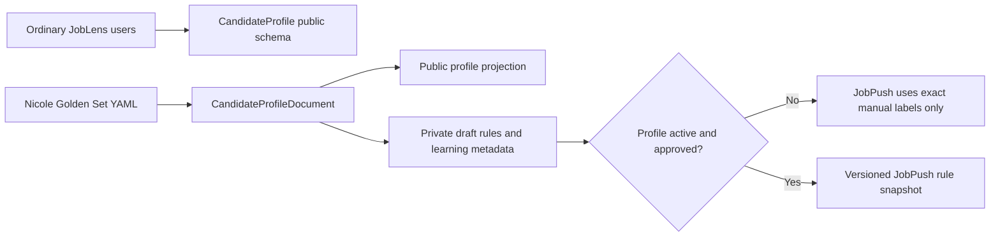

# Shared job-search profile

JobLens and JobPush must use one job-search intent, but they use it at different
stages:

- **JobLens** evaluates one full job description against the profile and resume.
- **JobPush** classifies titles from official career sites before a full job
  description is evaluated.

The canonical human-editable file belongs to JobLens:

`joblens/evals/golden_set/candidate_profile.yaml`

JobPush stores only a source pointer in
`config/job_search_profile_source.json`. Do not create a second hand-edited
copy. The canonical structure and learning contract are documented in the
JobLens file `docs/JOB_SEARCH_PROFILE.md`.

The internal document fields are not part of the ordinary `/me/profile` API,
onboarding form, or saved user JSON. Seniority/technical learning metadata stays
owner-only until a separately approved product feature exposes generic fields
to all users.

## Current status

Profile version `2026-06-27-draft-2` adds:

- Internship/entry/early-career preference with Senior as the maximum level.
- Lead, Staff, Principal, Director, Executive Director, Vice President, Head,
  Chief, Distinguished, and Fellow as seniority exclusions.
- Senior/Sr titles inside the SDE/software-engineering track are now excluded:
  Senior Software Engineer, Sr Backend Engineer, Senior Data Engineer, Senior
  Full-Stack Developer, Senior DevOps/Cloud/Security Engineer, etc. This rule is
  conditional and does not automatically exclude Senior Product Manager or other
  non-SDE senior titles.
- Machine-learning model work, Mechanical, Electrical, CAD/EDA, Embedded,
  firmware, RF, circuit, RTL, physical-design, and hardware domains as explicit
  exclusions.
- Applied AI/LLM application work as distinct from ML model development.
- Conditional handling for software tools/automation inside hardware teams,
  systems integration, and performance-modeling software.
- Open questions that are not active rules until reviewed.

The old JobLens profile listed Machine Learning Engineer as a target; the draft
removes that conflict.

## Decision precedence

1. Exact human title label.
2. Active hard seniority/technical exclusion.
3. Active target or conditional rule.
4. SOC/title mapping.
5. Otherwise `review`.

SOC is intentionally below personal capability constraints. A broad SOC family
can contain both relevant application-software roles and irrelevant hardware,
ML, or senior-leadership roles.

## HIGH-label import

The completed HIGH workbook was imported to production on 2026-06-23 through
`apply_manual_job_title_label`:

- 171 exact titles
- 37 target
- 133 non-target
- 1 review

Every decision has an audit-history row. These labels are immediately active;
the broad shared profile remains draft.

## Activation workflow

1. Edit the canonical JobLens YAML and answer `open_questions`.
2. Keep `profile_status: draft` while editing.
3. Validate it with the JobLens Pydantic schema.
4. Evaluate proposed rules against manual labels and a holdout set.
5. Review the proposed rule diff and affected examples.
6. Change the profile to `active` only after approval.
7. Explicitly synchronize the JobLens owner database profile. Editing YAML
   alone does not alter a logged-in account, and the existing sync command also
   updates the golden resume.
8. Publish an immutable snapshot with profile version, Git commit, checksum,
   and timestamp.
9. JobPush loads that snapshot and records its version on every rule decision.

If validation or publication fails, JobPush keeps the last valid profile and
sends ambiguous titles to review.

## Continuous improvement without silent self-training

The system may discover patterns, but it must propose rather than silently edit
the profile.

### Job-title loop

- Weekly while the classifier is new: review high-volume unresolved titles,
  false positives, and false negatives.
- Cluster repeated errors into proposed rules.
- Require at least 20 labeled examples and 98% precision before an automatic
  rule can be activated.
- Keep a 5–10% audit sample after activation.
- Move to monthly review only after review-rate and override-rate stabilize.

Track per rule: coverage, precision, manual overrides, examples, profile
version, activation date, and last audit date.

### Career-site loop

- Measure precision by source type, candidate rank, domain, and company tier.
- Auto-verify only narrow structured-ATS groups that meet the sample and
  precision threshold.
- Keep generic HTML, entity conflicts, and ambiguous brands manual.
- Monitor parsing success, zero-job regressions, country-scope failures, and
  wrong-company reports.
- Disable or roll back a discovery/adapter rule when drift is detected.

The profile learns from approved examples; the model does not become the source
of truth for its own future labels.

The dated audit calendar is maintained in
[`LEARNING_OPERATIONS.md`](LEARNING_OPERATIONS.md).
